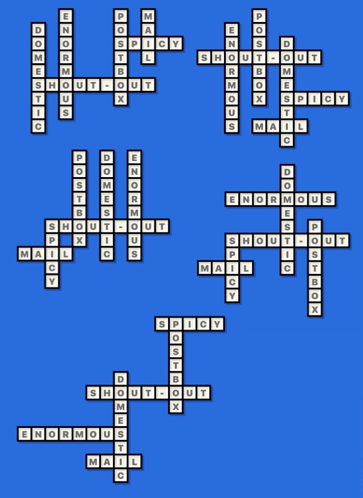

# CWG
> [crossword-generator](http://gaoryrt.com/crossword-generator/)

[](https://nodei.co/npm/cwg/)


> 5 different crosswords generated by CWG

## use
> `yarn dev`
```js
import CWG from 'cwg'

const words = [
  'do',
  'not'
]

const result = CWG(words) // then you can draw the crossword by this result
```

## result parameters
```js
// console.log(result)
{
  height: 2,            // height of the matrix
  width: 3,             // width of the matrix
  positionObjArr: [     // position of each input word, as input's order
    {
      wordStr: 'do',    // string of word
      xNum: 1,          // begin position x
      yNum: 0,          // begin position y
      isHorizon: false  // horizontal or vertical
    },
    {
      wordStr: 'not',
      xNum: 0,
      yNum: 1,
      isHorizon: true
    }
  ],
  ownerMap: [           // matrix of the crossword
    [
      empty,            // [0, 0]
      {                 // [0, 1]
        letter: 'd',    // letter of this position
        vertical: 0     // which word this letter belongs to. in this case, it's 0th: 'do'
      },
      empty             // [0, 2]
    ],
    [
      { letter: "n", horizontal: 1 },              // [1, 0]
      { letter: "o", vertical: 0, horizontal: 1 }, // letter of [1, 1] belongs to both words
      { letter: "t", horizontal: 1 }               // [1, 2]
    ]
  ]
}
```


## todo
- [ ] handle no-result words
- [ ] do not sort the input array at the beginning
